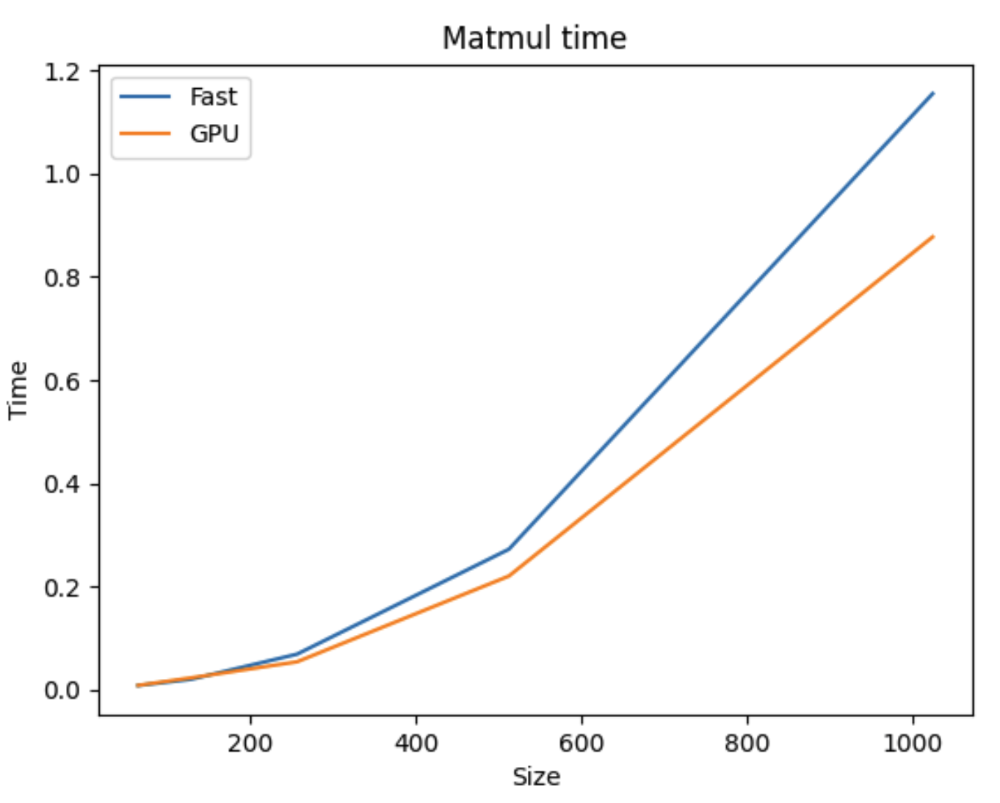
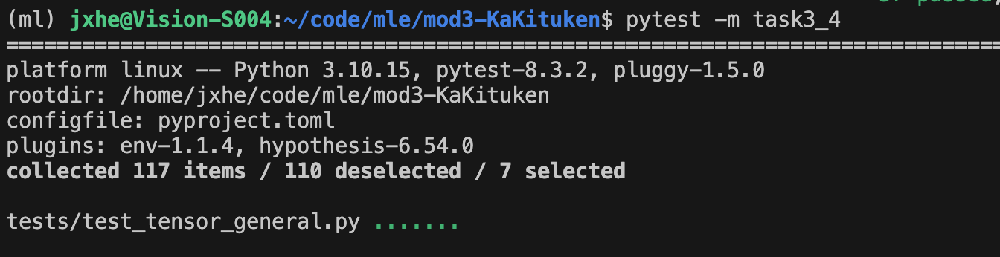
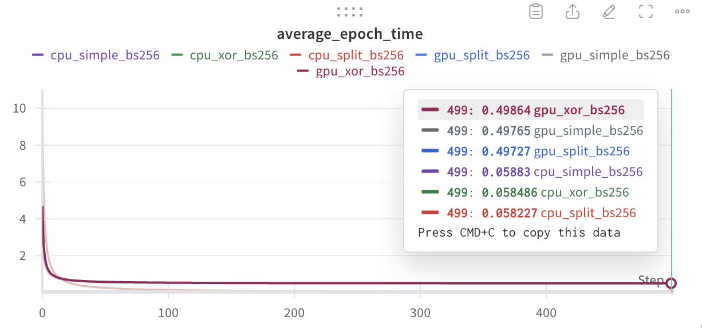
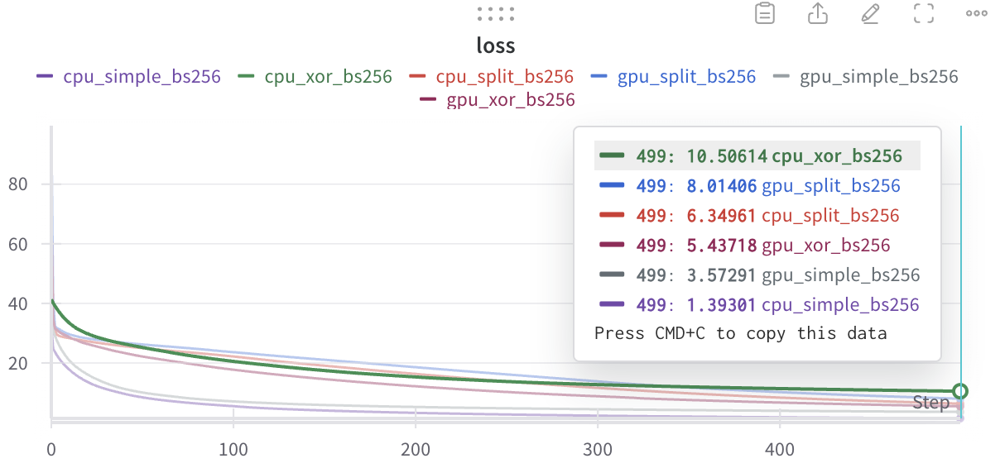
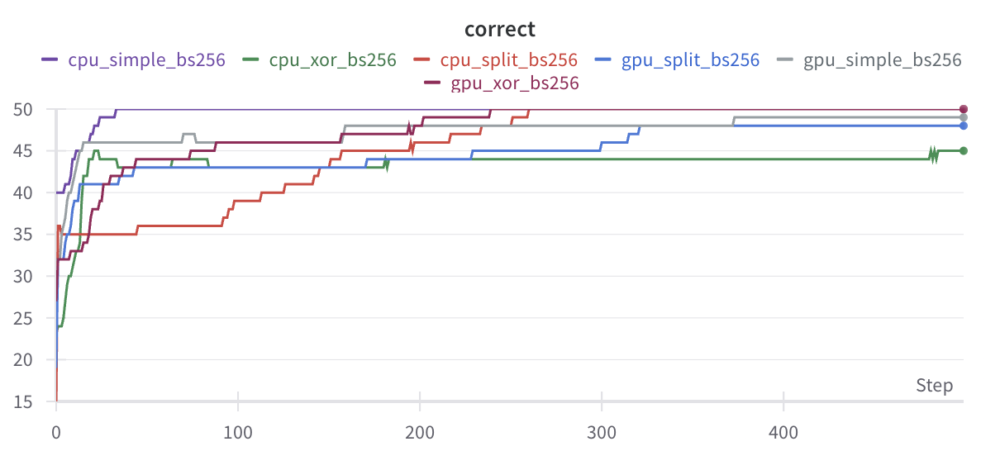
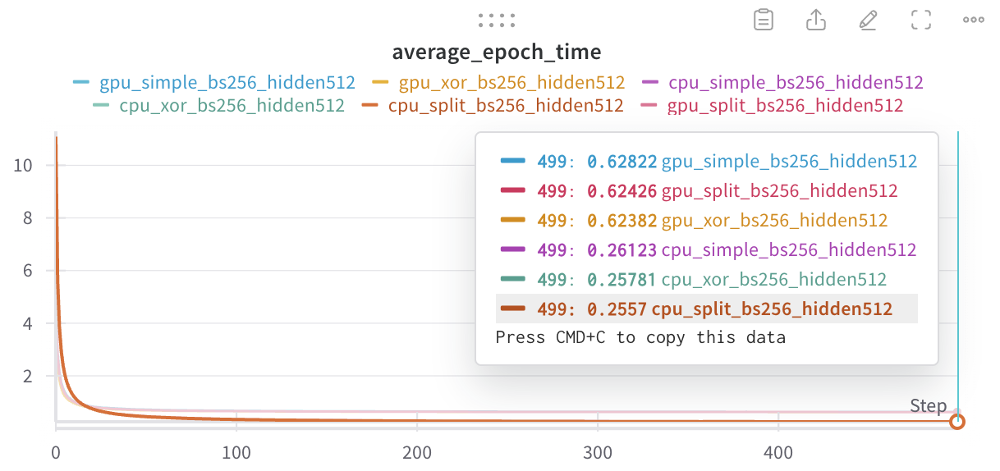
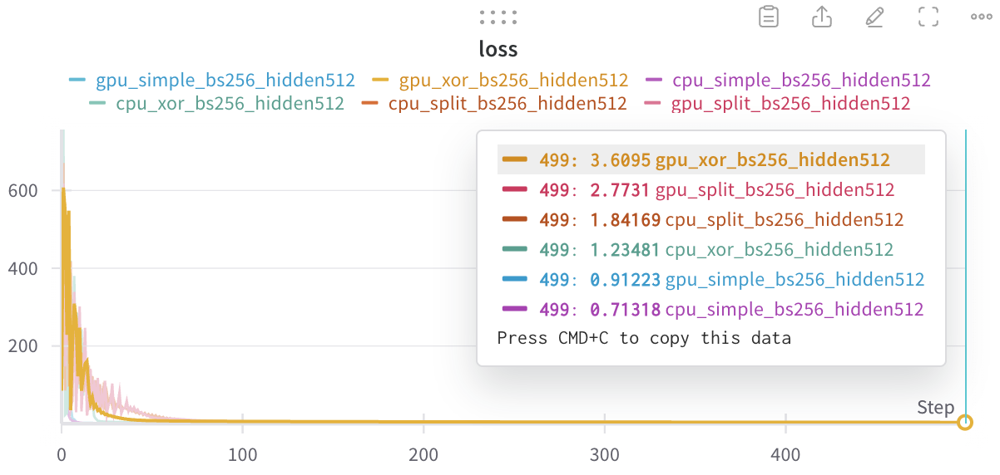
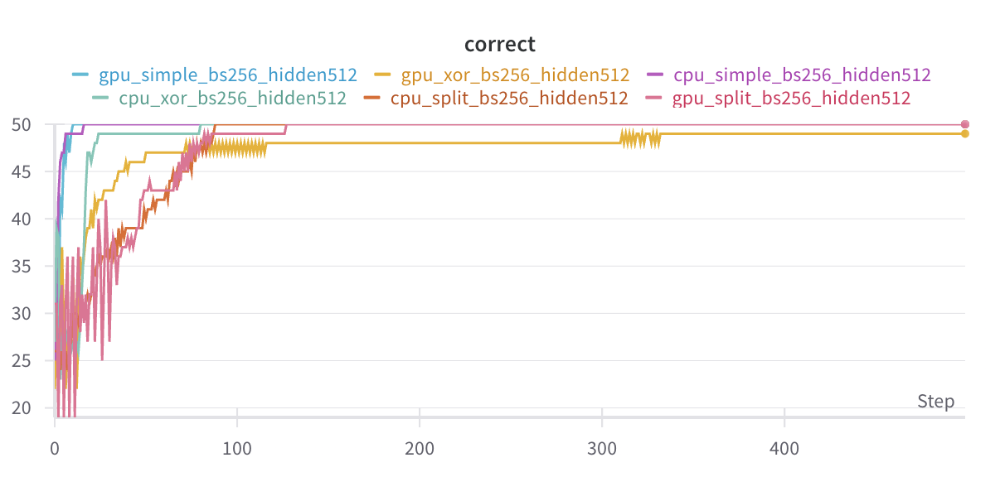

# MiniTorch Module 3

## Task 3-1

### Map


### Zip


### Reduce


### Matrix Multiply


## Task 3-4

### Documantation

`_mm_practice`

```python
def _mm_practice(out: Storage, a: Storage, b: Storage, size: int) -> None:
    BLOCK_DIM = 32
    # TODO: Implement for Task 3.4.

    cache_a = cuda.shared.array((BLOCK_DIM, BLOCK_DIM), numba.float64)	# use (32, 32) cache to store a
    cache_b = cuda.shared.array((BLOCK_DIM, BLOCK_DIM), numba.float64)	# use (32, 32) cache to store b

    i = cuda.blockIdx.x * cuda.blockDim.x + cuda.threadIdx.x	# global x index for the thread
    j = cuda.blockIdx.y * cuda.blockDim.y + cuda.threadIdx.y
    # global y index for the thread

    if i < size and j < size:
        # move to shared memory
        cache_a[i, j] = a[i * size + j]	# index to storage
        cache_b[i, j] = b[i * size + j]	# index to storage
        cuda.syncthreads()
        # compute
        res = 0.0	# use a local memory to store result
        for k in range(size):
            res += cache_a[i, k] * cache_b[k, j] # matrix multiplication
        # write to global memory
        out[i * size + j] = res
```

`_tensor_matrix_multiply`

```python
def _tensor_matrix_multiply(
    out: Storage,  # Output storage to write the result to.
    out_shape: Shape,  # Shape of the output matrix.
    out_strides: Strides,  # Strides for indexing the output matrix.
    out_size: int,  # Total size of the output matrix.
    a_storage: Storage,  # Storage of the first input matrix.
    a_shape: Shape,  # Shape of the first input matrix.
    a_strides: Strides,  # Strides for indexing the first input matrix.
    b_storage: Storage,  # Storage of the second input matrix.
    b_shape: Shape,  # Shape of the second input matrix.
    b_strides: Strides,  # Strides for indexing the second input matrix.
) -> None:
    # Stride to move across batch dimensions in the input matrices.
    a_batch_stride = a_strides[0] if a_shape[0] > 1 else 0
    b_batch_stride = b_strides[0] if b_shape[0] > 1 else 0

    # Fixed batch dimension for the computation, determined by blockIdx.z.
    batch = cuda.blockIdx.z

    # Shared memory to load a tile of matrix A and matrix B into faster local storage.
    BLOCK_DIM = 32  # Block size, assuming square tiles of 32x32.
    a_shared = cuda.shared.array((BLOCK_DIM, BLOCK_DIM), numba.float64)
    b_shared = cuda.shared.array((BLOCK_DIM, BLOCK_DIM), numba.float64)

    # Compute global row index `i` and column index `j` for the output matrix.
    i = cuda.blockIdx.x * cuda.blockDim.x + cuda.threadIdx.x
    j = cuda.blockIdx.y * cuda.blockDim.y + cuda.threadIdx.y

    # Compute the local thread positions `pi` and `pj` within a block.
    pi = cuda.threadIdx.x  # Row within the current thread block.
    pj = cuda.threadIdx.y  # Column within the current thread block.

    # Ensure the matrix dimensions are valid for multiplication.
    assert a_shape[-1] == b_shape[-2], "The last dimension of A must match the second-to-last dimension of B"

    # Initialize the accumulator for the dot product result.
    res = 0.0

    # Loop over the tiles along the shared dimension.
    for t in range((a_shape[-1] + BLOCK_DIM - 1) // BLOCK_DIM):
        # Load a tile of matrix A into shared memory.
        if i < a_shape[-2] and t * BLOCK_DIM + pj < a_shape[-1]:
            # Compute the position in the storage for A.
            a_pos = (
                batch * a_batch_stride
                + i * a_strides[1]  # Row position in A.
                + (t * BLOCK_DIM + pj) * a_strides[2]  # Column offset for the tile.
            )
            a_shared[pi, pj] = a_storage[a_pos]  # Copy value from global to shared memory.
        else:
            a_shared[pi, pj] = 0.0  # Pad with zeros if out of bounds.

        # Load a tile of matrix B into shared memory.
        if t * BLOCK_DIM + pi < b_shape[-2] and j < b_shape[-1]:
            # Compute the position in the storage for B.
            b_pos = (
                batch * b_batch_stride
                + (t * BLOCK_DIM + pi) * b_strides[1]  # Row offset for the tile.
                + j * b_strides[2]  # Column position in B.
            )
            b_shared[pi, pj] = b_storage[b_pos]  # Copy value from global to shared memory.
        else:
            b_shared[pi, pj] = 0.0  # Pad with zeros if out of bounds.

        # Synchronize all threads in the block to ensure tiles are fully loaded.
        cuda.syncthreads()

        # Compute the dot product for the current tile.
        if i < out_shape[-2] and j < out_shape[-1]:
            for k in range(BLOCK_DIM):  # Iterate over the shared dimension within the tile.
                res += a_shared[pi, k] * b_shared[k, pj]

        # Synchronize again to ensure all threads are done with this tile before the next one.
        cuda.syncthreads()

    # Write the final computed result to the global memory.
    if i < out_shape[-2] and j < out_shape[-1]:
        # Compute the position in the output storage.
        o = batch * out_strides[0] + i * out_strides[1] + j * out_strides[2]
        out[o] = res  # Store the computed value in global memory.

# Compile the kernel function with CUDA.
tensor_matrix_multiply = jit(_tensor_matrix_multiply)
```

### Comparision



Note that the code was run on a computing server carrying a Intel(R) Xeon(R) CPU E5-2670 v3 @ 2.30GHz with 24 cores, 48 threads. Therefore **the CPU version much faster than using Colab**, which is usually 5x slower than mine.

## Task 3-3


## Task 3-4



## Task 3-5

### For the smaller one

Use 100 hidden size, batch size 256







### For the bigger one

Use 512 hidden size, batch size 512







